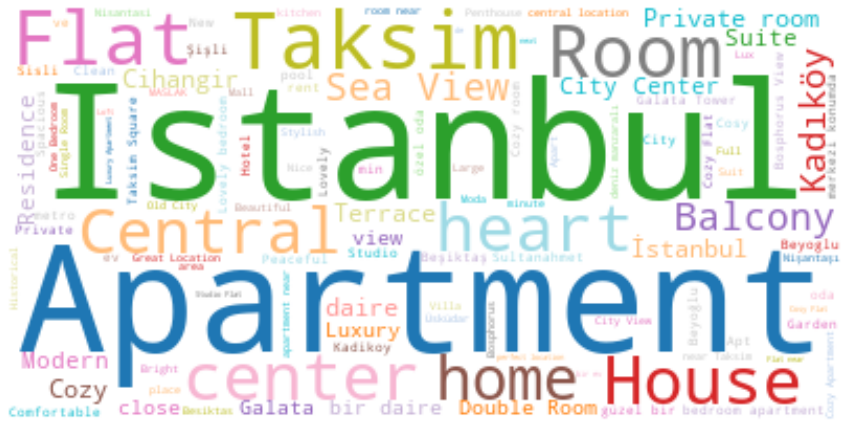

# Istanbul Airbnb EDA
This is another beginner friendly EDA project applied on Istanbul Airbnb listings data set to gather some insights as a "future Airbnb host". 

EDA is applied using the fundamental Python function similar to the previous Maintenance EDA project (https://github.com/tuirk/Maintenance-Data-Set-EDA) but this time the scope and research questions are defined.

The aim of this project is to examine the data of AirBnbs in Istanbul from the perspective of someone who wants to buy an investment property in Istanbul. In this context, answers to the following questions will be sought:

1. Which neighborhood has the most AirBnb?
2. What types of AirBnb are most common?
3. What is the AirBnB type distribution by district?
4. How do the average nightly prices vary according to the districts?
5. How does the average nightly return for AirBnbs vary by type?
6. How do the nightly prices vary according to AirBnb types?
7. How does the minimum number of nights vary according to AirBnb types?
8. Are there hosts with multiple Airbnb listings?
9. Which words are used most in advertisements?

Again there is a presentation and a report written in Turkish that Google Translate could easily help with other languages.

The original data source is from http://insideairbnb.com/istanbul . Inside Airbnb is a project that provides data on Airbnb's impact on residential communities. Data is collected, cleaned, organized, and made ready for use by the Inside Airbnb. I have selected Istanbul however there are many other cities to select from. I also prepared an interactive Excel Dashboard using the same data set: https://github.com/tuirk/Istanbul-Airbnb-Excel-Dashboard 
